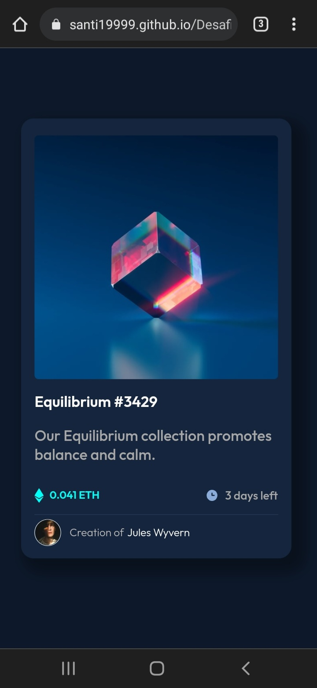
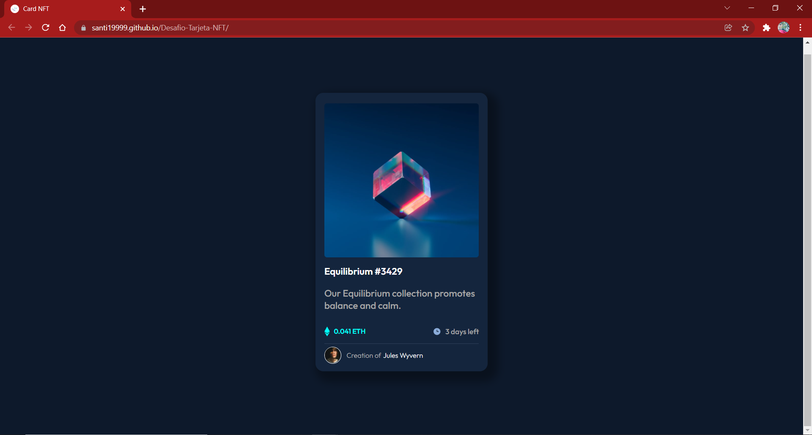

# Frontend Mentor - NFT preview card component solution

Este repositorio es la solución del desafío [NFT preview card component challenge on Frontend Mentor](https://www.frontendmentor.io/challenges/nft-preview-card-component-SbdUL_w0U).
Estos desafíos propuestos por esta excelente página, te ayudarán a mejorar las habilidades de programación que tienes, con proyectos reales en los que puedes poner en práctica tus conocimientos.
## Guía de contenido

 - [Descipción general](#descripción-general)
	 - [Detalles del Reto](#detalles-del-reto)
	 - [Screenshot](#screenshot)
	 - [Enlaces](#enlaces)
 - [Mi proceso desarrollando el desafío](#mi-proceso-desarrollando-el-desafío)
	 - [Método de construcción](#método-de-construcción)
	 - [Lo aprendido](#lo-aprendido)
	 - [Dudas Surgidas](#dudas-surgidas)
	 - [Correcciónes](#correcciones)

## Descripción general 

### Detalles del reto

Los usuarios deberían poder:
- *Ver el diseño de la tarjeta en cualquier dispositivo.*
- *Ver los diferentes estados de los elementos interactivos.*
- *Distinguir correctamente la sombra de la tarjeta.*
- *Todo el contenido centrado en la página.

### Screenshot

### Enlaces
- Solución URL: [GitHub](https://github.com/santi19999/Desafio-Tarjeta-NFT.git)
-  Sitio Online: [GitHub Pages](https://santi19999.github.io/Desafio-Tarjeta-NFT/)

## Mi proceso desarrollando el desafío
### Método de construcción
- HTML5 semántico.
- Propiedades CSS personalizadas.
- FlexBox (alineamiento y posicionamiento del contenido).
### Lo aprendido
 - [ ] CSS
	 - [ ] Alineación de la tarjeta, tanto vertical como horizontal.
		 - [ ] Utilizando medidas relativas (vw, vh) para el contenedor padre.
	 - [ ] Sombreado de la Tarjeta
	 - [ ] Redimencionamiento, para adaptar el diseño a dispositivos móviles.
	 - [ ] Utilizar margin:auto; para posicionar enlace en el lugar indicado.

	### Dudas surgidas
	- Cómo aplicarle el hover a la imagen, para que se vea el background y la imagen por encima de la imagen original de fondo.

	### Correcciones
	- La imagen que esta dentro de `.card-header` tiene un pequeño espacio abajo que hizo que aplique `border-radius` en la imagen y no en el padre. 
	
		- Para evitar ese espacio se debe aplicar  `display: block` en la imagen `.card-header img` y así se puede aplicar `border-radius` en `.card-header` con `overflow: hidden`.
		Solución propuesta por[ **Andrés Gutiérrez Ramírez** ] https://www.frontendmentor.io/profile/AGutierrezR 

### Autor

 - FrontendMentor-[@santi19999] [https://www.frontendmentor.io/profile/santi19999](https://www.frontendmentor.io/profile/santi19999)
 - GitHub- [@santi19999]-https://github.com/santi19999

				 
